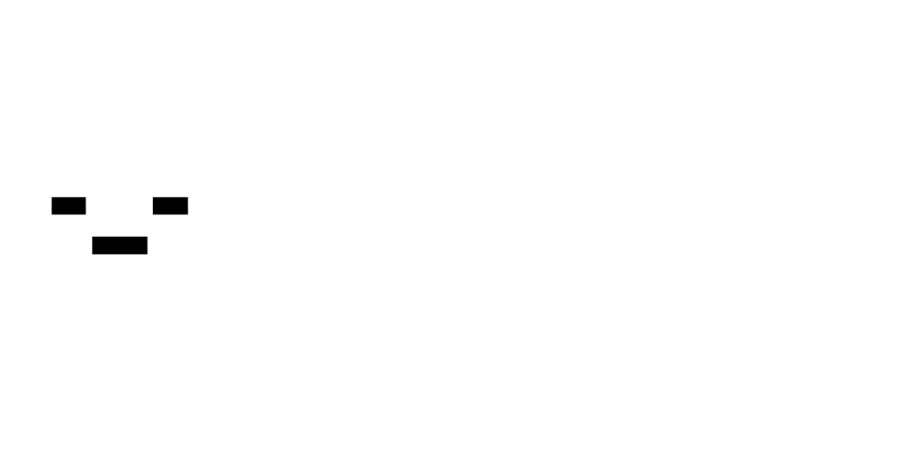

    

---

**LiveFrame** - полноценный анимационный движок для
[Voxel Core](https://github.com/MihailRis/voxelcore/tree/main), написанный на **Lua**, с
собственным форматом анимаций **LFA**, дополнительной поддержкой **glTF** & **glB**,
поддержкой аниматоров и простых проигрывателей анимаций, а также удобным
**API** для контент-паков. Документация [здесь](docs/ru/public/README.md).

[Гайд по использованию для чайников](docs/ru/public/teapot_guide.md)

> [!WARNING]
> Поскольку проект находится в стадии публичного бета-тестирования, в некоторых местах может быть сломана
> обратная совместимость. Вы соглашаетесь с этим используя бета-версию.

## Связанные проекты

- [**LiveFrame-BBPlugin**](https://github.com/Onran0/LiveFrame-BBPlugin) - плагин для **Blockbench**,
позволяющий экспортировать анимации в **LFA**.

## Лицензия

Проект лицензирован под **Apache 2.0**.
