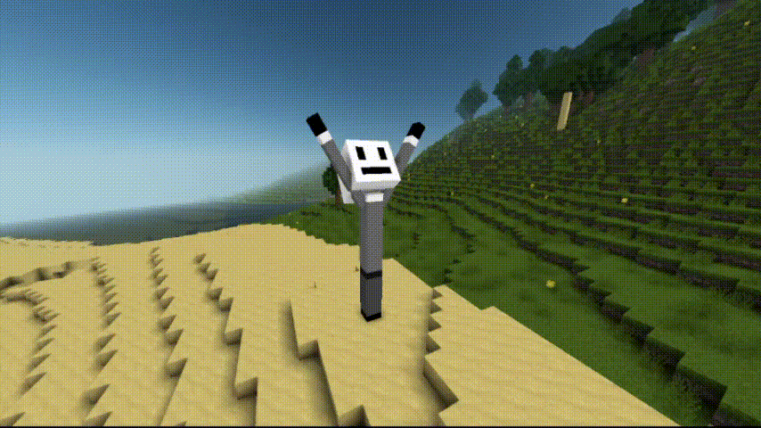

# Гайд по использованию LiveFrame для чайников

Это простой гайд с пошаговыми инструкциями, благодаря которым вы сможете пройти путь от
экспортирования модели и её анимаций из **Blockbench**, до её загрузки и воспроизведения
на сущностив **VoxelCore**.

## Шаг 1: Установка плагинов для Blockbench

Вам понадобятся следующие плагины:

1) [VoxelBench](https://github.com/Onran0/voxelbench/blob/master/README-ru.md) - С помощью данного плагина вы сможете экспортировать свою модель в
файлы формата `VCM` или `VEC3`, родные для **VoxelCore**. В гайде мы будем рассматривать только `VCM` из-за его удобства в плане риггинга и самодостаточности.


2) [LiveFrame-BBPlugin](https://github.com/Onran0/LiveFrame-BBPlugin/blob/master/README-ru.md) - А с помощью этого плагина вы сможете экспортировать анимации
в файлы формата `LFA`, которые можно передать в **LiveFrame**.

## Шаг 2: Экспорт модели и анимаций

Теперь, когда мы установили плагины, вам нужно экспортировать свою модель и анимации из **Blockbench** в контент-пак.

Как создать свой контент-пак и сущность мы рассматривать в этом гайде не будем, но для новичков вся информация находится
[здесь](https://github.com/MihailRis/voxelcore/blob/main/doc/ru/main-page.md) - официальная документация **VoxelCore**.

Экспортируйте модель в папку `models` вашего контент-пака с помощью кнопок
`File -> Export -> Export .VCM Model` или
`Файл -> Экспорт -> Экспорт VCM-модели` в русской локализации.

Экспортируйте анимации в папку `animations` вашего контент-пака с помощью кнопок
`File -> Export -> Export animations to LFA` или
`Файл -> Экспорт -> Экспорт анимаций в LFA` в русской локализации, не меняя
настройки экспорта по-умолчанию.

> [!NOTE]
> Обратите внимание, что текстуры нужно экспортировать отдельно от модели, в папку `textures`
> вашего контент-пака. Также имена текстур должны соответствовать тем, что вы задали в **Blockbench**.

> [!NOTE]
> Также, на самом деле, не имеет значения в какую папку экспортировать конкретно анимации. Но для
> удобства и инкапсуляции ассетов лучше сделать так.

## Шаг 3: Добавьте текстуры в `preload.json`

Это необходимо для того, чтобы они отображались на модели, поскольку мы используем её на
сущности.

Как это сделать описано [здесь](https://github.com/MihailRis/voxelcore/blob/main/doc/ru/assets-preload.md).

## Шаг 4: Привяжите к сущности модель

Для этого напишите в поле `skeleton-name`  конфига сущности имя файла модели (без расширения).

## Шаг 5: Привяжите компонент проигрывателя к сущности

В данном гайде мы будем рассматривать только проигрыватель.

**Проигрыватель** - простой проигрыватель анимаций, без смешивания, состояний и так далее.
Он просто принимает файл с анимациями и проигрывает ту, что вы прикажите через **API**.

Сделать это можно следующим образом:

```json
{
  "components": [
      {
          "name": "liveframe:player",
          "args": {
              "path": "id_вашего_пака:путь_к_файлу_с_анимациями.lfa"
          }
      }
  ]
}
```

## Шаг 6: Получите объект проигрывателя из своего компонента

Добавьте на сущность какой-либо свой компонент. Затем, из него можно получить объект проигрывателя
следующим образом:

```lua
local player = entity:require_component("liveframe:player").get()
```

> [!WARNING]
> Важно: Ваш компонент по списку должен быть определён после компонента проигрывателя, чтобы
> на момент попытки получения, проигрыватель уже был инициализирован.

## Шаг 7: Проиграйте анимацию

Вызовите метод `play` и передайте туда название анимации, которое вы задавали в **Blockbench**.
Вот так:

```lua
player:play("waving")
```

## Шаг 8: Наслаждайтесь результатом



## Что дальше?

Для более сложных сценариев использования ознакомьтесь с [главной страницей](README.md) документации **LiveFrame**.